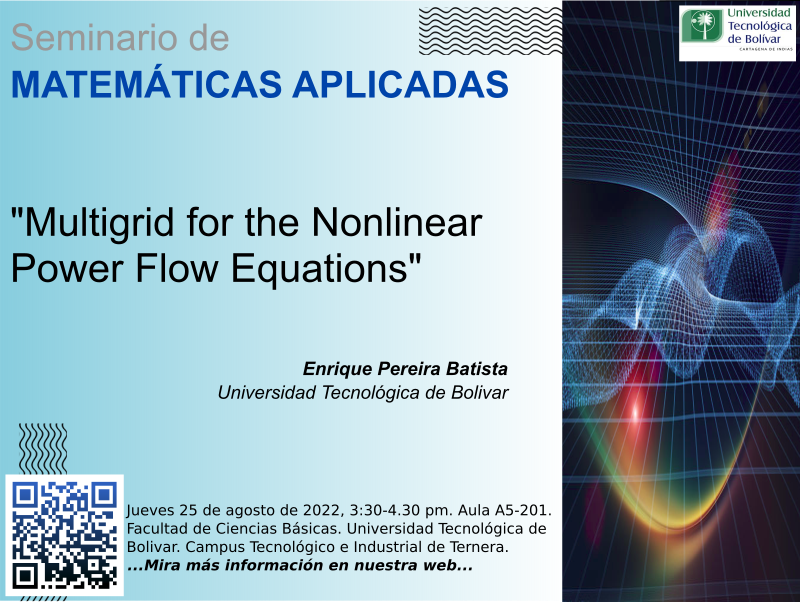
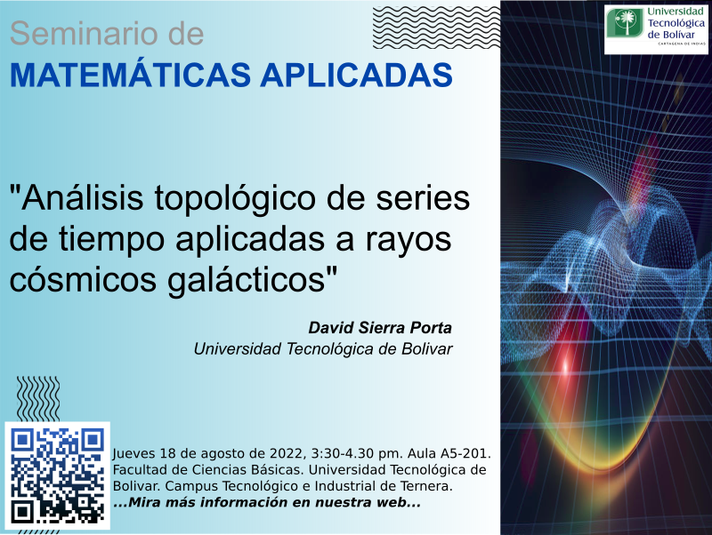

# Grupo de Gravitación y Matemáticas Aplicadas

Página del Grupo de Investigación en Gravitación y Matemáticas Aplicadas de la Facultad de Ciencias Básicas de la Universidad Tecnológica de Bolivar (UTB), Cartagena de Indias Colombia
 

El grupo de investigación Gravitación y Matemática Aplicada se especializa en aplicar los métodos matemáticos a problemáticas concretas de la física y la ingeniería. 

| Enlaces... | |
| --- | --- |
| Código Colciencias: COL0101357 | Categoría del Grupo: R (Convocatoria 2018) |
| [GIGMA en UTB](https://www.utb.edu.co/investigacion/apoyo-a-la-investigacion/grupos-de-investigacion/grupo-de-investigacion-gravitacion-y-matematica-aplicada/) | [GIGMA en GRUPLAC](https://scienti.minciencias.gov.co/gruplac/jsp/visualiza/visualizagr.jsp?nro=00000000010193) |

Líneas de Investigación: Sistemas dinámicos | Teoría de representación de álgebras de Lie | Métodos estadísticos clásicos, Bayesianos y Ciencia de Datos. | 
Clima espacial y rayos cósmicos. 

## Integrantes del grupo

| Integrantes | Redes |
| ----------- | ----- |
| MUENTES ACEVEDO, JEOVANNY DE JESUS | [cvlac](https://scienti.minciencias.gov.co/cvlac/visualizador/generarCurriculoCv.do?cod_rh=0000144922) - [scopus](https://www.scopus.com/authid/detail.uri?authorId=57222990626) - [orcid](https://orcid.org/0000-0001-7419-482X) - [scholar](https://scholar.google.com/citations?hl=en&user=3qJUzoEAAAAJ) |
| DOMÍNGUEZ MONTERROZA, ANDY RAFAEL | [cvlac](https://scienti.minciencias.gov.co/cvlac/visualizador/generarCurriculoCv.do?cod_rh=0001181327) - [scopus](https://www.scopus.com/authid/detail.uri?authorId=57200983451) - [orcid](https://orcid.org/0000-0002-5274-7443) - [scholar](https://scholar.google.com/citations?hl=en&user=RdFqwb8AAAAJ) |
| PAYARES GUEVARA, CARLOS RAFAEL | [cvlac](https://scienti.minciencias.gov.co/cvlac/visualizador/generarCurriculoCv.do?cod_rh=0000859125) - [scopus]() - [orcid](https://orcid.org/0000-0001-5244-6504) - [scholar](https://scholar.google.com/citations?hl=en&user=pTicCVYAAAAJ) |
| VILLALBA ACEVEDO , JORGE LUIS | [cvlac](https://scienti.minciencias.gov.co/cvlac/visualizador/generarCurriculoCv.do?cod_rh=0001638794) - [scopus]() - [orcid](https://orcid.org/0000-0002-2888-9660) - [scholar]() |
| SIERRA PORTA, DAVID | [cvlac](https://scienti.minciencias.gov.co/cvlac/visualizador/generarCurriculoCv.do?cod_rh=0000125474) - [scopus](https://www.scopus.com/authid/detail.uri?authorId=57191333650) - [orcid](https://orcid.org/0000-0003-3461-1347) - [scholar](https://scholar.google.com/citations?hl=en&user=-OInFfYAAAAJ) |

## Lineas de Investigación

1. **Sistemas Dinámicos**
El principal objetivo es comprender el comportamiento cualitativo de sistemas determinísticos. Las técnicas, preguntas son variadas y van desde el uso de métodos probabilísticos, a técnicas puramente topológicas. Es una disciplina estrechamente relacionada con la física. Por otra parte, sistemas dinámicos ha encontrado aplicaciones en las más diversas áreas de la matemática, desde la teoría de números a las ecuaciones en derivadas parciales. Las aplicaciones son variadas,  desde las finanzas a la sociología. Partes de la teoría de sistemas dinámicos como fractales y caos ha recibido gran atención mediática en el  último tiempo. En la Facultad existe un grupo con diversos intereses, con fuertes redes internacionales, con seminarios, congresos e invitados que lo hacen un lugar perfecto para especializarse en este tema.
Logros: Se han publicado un par de artículos: 
- Genericity of Continuous Maps with Positive Metric Mean Dimension. Acevedo, J.M. Results in Mathematics, 2022, 77(1), 2
- Mean Dimension and Metric Mean Dimension for Non-autonomous Dynamical Systems. Rodrigues, F.B., Acevedo, J.M. Journal of Dynamical and Control Systems, 2021.
- Analytic Approximations to Liénard Nonlinear Oscillators with Modified Energy Balance Method 	Sierra-Porta, D.  2020. Journal of Vibration Engineering and Technologies 8(5), pp. 713-720.
Responsables de la Linea: MUENTES ACEVEDO, JEOVANNY DE JESUS.

2. **Álgebras de Lie**
El problema central en la teoría de álgebras de Lie modular es la clasificación de las álgebras de Lie simple, este problema sobre un cuerpo de característica 2 es aún abierto. En este grupo, nos dedicamos a estudiar este problema para aquellas álgebras de Lie con 2-estructura, específicamente, estudiamos las 2-álgebras de Lie simple de rango toral 3 y su clasificación. 
Logros: Se han publicado un par de artículos: 
- Classical simple Lie 2-algebras of odd toral rank and a contragredient Lie 2-algebra of toral rank 4. PG Carlos R., AA Fabian A. Revista de la Unión Matemática Argentina 62 (1), 123-139, 2021
Responsables de la Linea: PAYARES GUEVARA, CARLOS RAFAEL.

3. **Métodos Estadísticos Clásicos, Bayesianos y Ciencia de Datos**
Desarrolla y estudia las propiedades de modelos estadísticos clásicos. Los intereses específicos incluyen la teoría de distribuciones paramétricas de probabilidad, el desarrollo de medidas de influencia local y global, técnicas de muestreo, y de series de tiempo. Desarrolla y estudia las propiedades de modelos estadísticos Bayesianos. Los intereses específicos incluyen el desarrollo de modelos Bayesianos paramétricos y no paramétricos. Desarrolla y estudia las propiedades de métodos estadísticos que pueden ser utilizados a través de las ciencias. Desarrolla y estudia las propiedades de métodos estadísticos para identificar patrones y hacer predicciones sobre la base de grandes volúmenes de datos. Los intereses específicos incluyen las ciencias sociales y biomédicas, y el desarrollo de técnicas estadísticas y de aprendizaje automático.
Logros: Se han publicado un par de artículos: 
- Hydrogeochemical Evaluation of Water Quality Suitable for Human Consumption and Comparative Interpretation for Water Quality Index Studies 	Sierra-Porta, D. 2020. Environmental Processes 7(2), pp. 579-596.
- Multidimensional Perspective of Poverty in Colombian Households. EJ Medina-Hernández, LF Sierra-Ibáñez, AR Domínguez-Monterrosa. Sociedad y Economía. 2021.
- Sierra Porta, David (2022), “MultiFractal Detrented Fluctuations Analysis on Cosmic Rays Time Series”, Mendeley Data, V1, doi: 10.17632/kkk7ckvhcw.1
- Sierra Porta, David (2022), “Air Quality Bogota.”, Mendeley Data, V1, doi: 10.17632/z6wtdbkc5b.1
Responsables de la Linea: DOMÍNGUEZ MONTERROZA, ANDY RAFAEL; VILLALBA ACEVEDO , JORGE LUIS; SIERRA PORTA, DAVID.

4. **Clima Espacial y Rayos Cósmicos**
El Clima Espacial (CE) se refiere a las condiciones de la magnetosfera o campo magnético terrestre y la atmósfera ionizada que pueden ser afectadas por la actividad del Sol influyendo en la operación y confiabilidad de sistemas tecnológicos satelitales y en tierra, que a su vez causan riesgos en infraestructura y salud humana. El planeta Tierra recibe constantemente el impacto de los rayos cósmicos, partículas expulsadas por estrellas y galaxias lejanas. Estos mensajeros del espacio exterior aportan mucha información sobre la historia y la composición del Universo. La física de los rayos cósmicos es un campo de investigación activo, con muchos experimentos en curso que abordan cuestiones sobre su origen, naturaleza, aceleración y propagación. La amplísima gama de energías de los rayos cósmicos implica que se utilicen diferentes métodos de detección, desde complejos experimentos en el espacio hasta detectores terrestres de lluvia de aire gigante. El grupo de rayos cósmicos cubre parte de esta gama.
Logros: Algunos artículos publicados: 
- Muography in Colombia: Simulation Framework, Instrumentation, and Data Analysis. L. A. Núñez Peña-Rodríguez, A. Vesga-Ramírez, A. Vásquez-Ramírez, M. Suárez-Durán, R. de León-Barrios, D. Sierra-Porta, R. Calderón-Ardila, J. Pisco-Guavabe, H. Asorey, J. D. Sanabria-Gómez. Journal of Advanced Instrumentation in Science 2022 (JAIS-271, 2022), 1-9.
- Simulated Annealing for volcano muography. Vesga-Ramírez, A., Sanabria-Gómez, J.D., Sierra-Porta, D., (...), Calderón-Ardila, R., Núñez, L.A. 2021. Journal of South American Earth Sciences 109,103248
- Calibration and first measurements of MuTe: a hybrid Muon Telescope for geological structures 	Peña-Rodríguez, J., Vásquez-Ramírez, A., Sanabria-Gómez, J.D., (...), Sierra-Porta, D., Asorey, H. 2021. Proceedings of Science 358,381.
- Design and construction of MuTe: a hybrid Muon Telescope to study Colombian volcanoes. Peña-Rodríguez, J., Pisco-Guabave, J., Sierra-Porta, D., (...), Asorey, H., Núñez, L.A. 	2020 	Journal of Instrumentation 15(9),P09006.
- Muon tomography sites for colombian volcanoes. Vesga-Ramírez, A., Sierra-Porta, D., Peña-Rodríguez, J., (...), Asorey, H., Núñez, L.A. 	2020 	Annals of Geophysics. 63(6),VO661, pp. 1-26. 
Responsables de la Linea: SIERRA PORTA, DAVID

**A partir de las lineas de investigación se han creado y generado los siguientes productos:**
- Semillero de Astronomía y Ciencia de datos, adscrito a la Facultad de Ciencias Básicas de la UTB
- Semillero de Matemática Aplicada, adscrito a la Facultad de Ciencias Básicas de la UTB
- Varias actividades en torno al proyecto ONDAS para la apropiación de conocimiento. Actividades con niños, niñas y adolescentes de la Región, en torno a Ciencias de Datos, Astronomía, Tecnología y Clima espacial.
- Jornada de divulgación en torno a las Olimpiadas matemáticas Regionales y Organización y realización de las Olimpiadas Matemáticas Regionales.
- Organización y realización del Workshop in Applied Statistic and Data Science, Cartagena 2022, con la participación de Internacionales y nacionales desarrollado en la UTB.

## Seminarios de grupo

Algunos de nuestros seminarios...

 
- Agosto 25, 2022. **"Multigrid for the Nonlinear Power Flow Equations"** Por Enrique Pereira Batista (Universidad Tecnológica de Bolivar, Cartagena Colombia). 

_The continuously changing structure of power systems and the inclusion of renewable energy sorces are leading to changes in the dynamics of modern power grid, which have brought renewed attention to the solution of the AC power flow equations. In particular, development of fast and robust solvers for the power flow problem continues to be actively investigated. Anovel multigrid technique for coarse-graining dynamic power grid models has been developed recently. This technique uses an algebraic multigrid (AMG) coarsening strategy applied to the weighted graph-Laplacian that arises from the power network ’stopology for the construction of coarse-grain approximations to the original model. Motivated by this technique, anewmultigrid method for the AC power flow equations is developed using this coarsening procedure. The AMG  coarsening procedure is used to build a multilevel hierarchy of admittance matrices, which automatically leads to a hierarchy of nonlinear power flow equations._
 

 
- Agosto 18, 2022. **"Análisis topológico de series de tiempo aplicadas a rayos cósmicos galácticos"** Por David Sierra Porta (Universidad Tecnológica de Bolivar, Cartagena Colombia). 

_Utilizamos multifractal detrented fluctuation analysis (MFDFA) para investigar la relación entre la rigidez magnética o "rigidez de corte" y la variabilidad y el comportamiento multifractal en la serie temporal del flujo de rayos cósmicos en la Tierra, que es detectado por los monitores de neutrones en la superficie terrestre. Dado que la rigidez de corte depende en gran medida de la latitud geográfica de los detectores, no todos los detectores producen recuentos de rayos cósmicos iguales. Nuestros resultados indican que existe un cierto sesgo en la naturaleza caótica de las series de rayos cósmicos asociado a la latitud de las estaciones de monitoreo._
 
